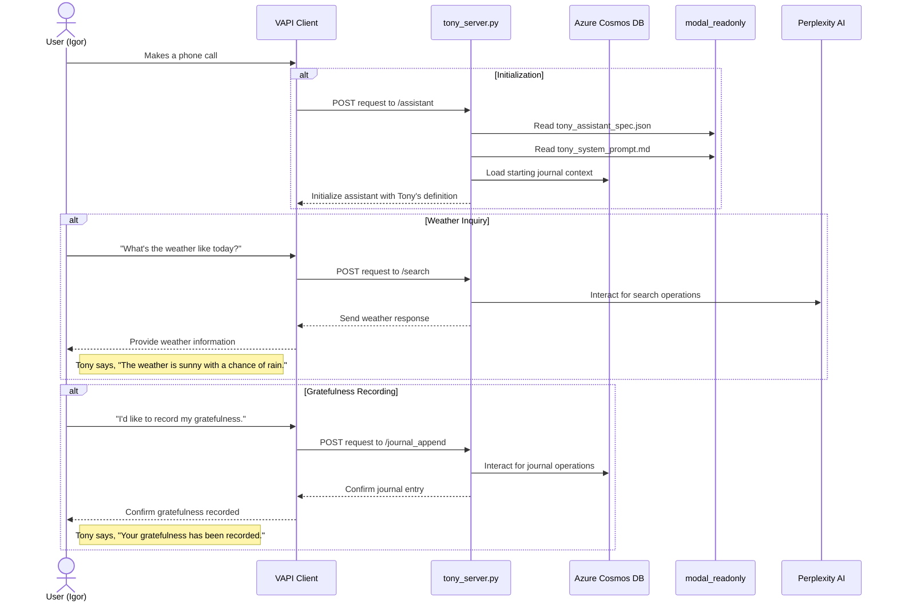

# Tony the tesla

[](https://github.com/idvorkin/tony_tesla/actions/workflows/python-tests.yml)
[](https://github.com/idvorkin/tony_tesla/actions/workflows/python-tests.yml)
[](https://github.com/idvorkin/tony_tesla/actions/workflows/python-tests.yml)
[](https://htmlpreview.github.io/?https://github.com/idvorkin/tony_tesla/blob/test-results/test-results/python/coverage/index.html)

This is my callable life coach! Lots of fun idea to be played with here.

- Life Coach
- Callable Agents
- Memory

## Example Conversation

### Igor after a a hard day


### Igor rationalizing his car free identity with driving a Tesla

🎧 [Listen to Igor work through his identity crisis with Tony, his AI life coach](https://github.com/idvorkin/blob/raw/master/blog/bike-vs-tony.mp3)


**The Story:** Igor was a dedicated cyclist (3,000+ miles in 2022) who prided himself on being car-free. After buying a Tesla, his cycling dropped to under 30 miles. Through conversations with his AI coach Tony (with a Tony Soprano personality), Igor realized that identity isn't about rigid adherence to past choices, but staying true to core values while adapting methods. He learned to use both bicycle and Tesla based on specific needs rather than seeing them as mutually exclusive.

[Read the full story at idvork.in/bike-tesla-identity](https://idvork.in/bike-tesla-identity)

### Bob (not his real name), trying Tony for the first time


## Tech

modal deploy tony_server
point vapi server API at modal serve

### Blog tools now via MCP

The blog tools (`blog_info`, `random_blog`, `read_blog_post`, `random_blog_url`, `blog_search`) are no longer served by our FastAPI app. They are provided by the Blog MCP server instead.

- Repo: [idvorkin/idvorkin-blog-mcp](https://github.com/idvorkin/idvorkin-blog-mcp)
- Live MCP endpoint: `https://idvorkin-blog-and-repo.fastmcp.app/mcp`

To enable these in the assistant, ensure `modal_readonly/tony_assistant_spec.json` contains the MCP tool entry in `assistant.model.tools`:

```json
{
  "type": "mcp",
  "function": { "name": "mcpTools" },
  "server": {
    "url": "https://idvorkin-blog-and-repo.fastmcp.app/mcp",
    "secret": "SHOULD_BE_REPLACED_BY_ASSISTANT"
  }
}
```

If you're configuring via a generic config snippet, it should look like:

```json
{
  "tools": [
    {
      "type": "mcp",
      "function": { "name": "mcpTools" },
      "server": { "url": "https://mcp.zapier.com/api/mcp/s/********/mcp" }
    }
  ]
}
```

Notes:

- Replace `secret` at runtime; `tony_server.py` injects `x-vapi-secret` for tools.
- Remove any legacy blog endpoints; they have been deleted from this repo.

## Sequence Diagram


