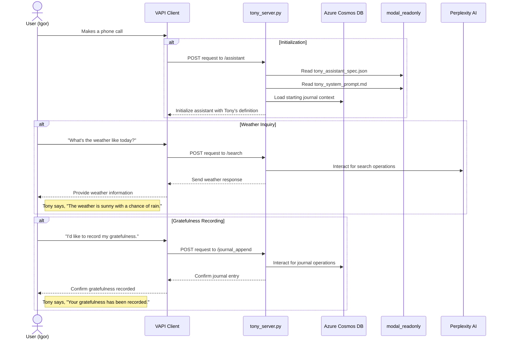

# Tony the tesla

This is my callable life coach! Lots of fun idea to be played with here.

* Life Coach
* Callable Agents
* Memory

## Tech

modal deploy tony_server
point vapi server API at modal serve

## Sequence Diagram

